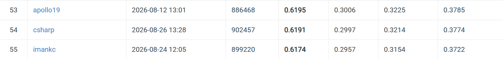
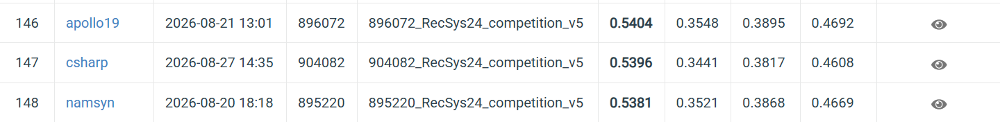

# News Recommendation at Scale: Lexical and Semantic Retrieval over MIND and EB-NeRD

**CS4.406 Information Retrieval & Extraction — Assignment 1** · Chaitanya Shah
Code: `src/newsrec/` · 240 tests · full decision log in `ARCHITECTURE.md` (D1–D31)

---

## 1. System and the choices that define it

Raw MIND (English, TSV) and EB-NeRD (Danish, Parquet) are ingested into **one unified
three-table schema** — `articles`, `impressions`, `history` (D3) — split **temporally**
(D7/D8), and persisted as a Parquet feature store rebuilt by one command in **2.81 s**.
Two retrievers run over that store; one evaluation harness scores both; the same scorers
generate the leaderboard submissions.

Every choice below was made against a measured number, with alternatives recorded.

| Decision | Chosen | Rejected, and the measured reason |
|---|---|---|
| DataFrame engine (D5) | Polars | pandas is eager and single-threaded; EB-NeRD-large is 13.5 M rows on 7.7 GB RAM. `scan_parquet` + streaming does in **1 s / 1.03 GB** what an eager pass cannot do at all |
| Inverted index (D14) | own `scipy.sparse` CSR/CSC | `rank_bm25`: **216× slower per query** (2,183.84 ms vs 10.10 ms p50), **30.3 h vs 8.4 min** for a val run. `bm25s` is fast but Q2.1 grades *building* an index |
| ANN index (D21) | exact brute force | FAISS costs recall — the metric Q3 reports — for speed we do not need; measured at **1.73 ms/query**, *faster* than the sparse index |
| Embedding model (D20) | `paraphrase-multilingual-MiniLM-L12-v2` | `distiluse-…-v1` has **no Danish** in its 13-language list and would have returned well-formed nonsense. Naive install pulls **2,894 MB** (2,238 MB unused CUDA) vs **390 MB** CPU-only |
| Vector storage (D22) | separate `embeddings.parquet`, vector beside its own id | a column on `articles` would be recomputed each rebuild: **2.81 s → ~13 min, a 280× regression**. A bare `.npy` + id list can silently drift out of alignment |
| Candidate pool (D19) | whole corpus **and** in-circulation | reporting only one hides that EB-NeRD's 2.45 % → 7.27 % gain is mostly the pool shrinking |

**One correction we are reporting rather than restating.** D14 justified rejecting
`rank_bm25` by asserting the run "would not finish". Measured, it finishes — in **30.3
hours**. The decision was right; the stated reason overshot. The defensible argument is
different and stronger: `rank_bm25` **builds 2.6× faster** (0.61 s vs 1.61 s) because it
stores token lists and defers all work to query time, and our extra 1.00 s of build cost
is repaid after **0.46 queries**. It moves work to the wrong side of a boundary crossed
50,000 times.

---

## 2. Engineering metrics

### Index construction and footprint (MIND, 65,238 articles)

| Artefact | Build | Size |
|---|---|---|
| BM25 inverted index | **1.61 s** | **19 MB** (60,951 terms, 2,361,877 non-zeros) |
| Embedding matrix (Parquet → contiguous float32) | 0.85 s load | **100 MB** — 5.2× the sparse index |
| BM25 queries, 50,000 users | 0.64 s | — |
| User vectors, 50,000 users | 0.88 s | 77 MB |
| Corpus embedding (one-off, CPU) | 246,502 articles @ 82–115/s = **43 min** | — |

Sparse wins storage 5.2×. It does **not** win latency.

### Latency, single query, top-200 (the serving-time number)

| Path | p50 | p95 | p99 |
|---|---|---|---|
| BM25 sparse | 10.10 ms | 13.47 ms | 20.21 ms |
| Semantic brute-force | **1.73 ms** | 4.51 ms | 6.50 ms |
| **Re-ranking one impression** | **0.01 ms** | 0.02 ms | 0.04 ms |

**Semantic retrieval is 5.8× faster than the sparse inverted index**, inverting the usual
intuition. A dense (65,238 × 384) float32 product is 100 MB of sequential, SIMD-friendly,
cache-predictable work handed to BLAS; a sparse query against CSR performs irregular
scattered gathers. *Sparse means less arithmetic, not less time.* This also retires any
suspicion that D21's "brute force" traded speed for exactness — at this scale it is both.

**Re-ranking is ~1,000× cheaper than retrieval.** That single ratio is why 13.5 M
leaderboard impressions are tractable while whole-corpus retrieval over the same set is
not, and it is the quantitative form of the distinction in §4.

### Throughput, and what batching actually bought

| Batch | Semantic throughput |
|---|---|
| 1 | 620 q/s |
| **32** | **1,269 q/s** |
| 256 | 727 q/s ← *regression* |

Batching was described in D14/D21 as an optimisation. Measured, it is a **memory
necessity with a modest, non-monotone throughput effect**: ~2× at best, and it *degrades*
past ~32 once a (256 × 65,238) float32 score block (67 MB) leaves cache. The real
justification is unchanged and unarguable — a full 37,777 × 65,238 matrix is **9.9 GB
against 7.7 GB of RAM** — but "batching is faster" was never true beyond batch ≈ 32.

### Scale limits, and the three optimisations that made 13.5 M impressions run locally

Submission generation: **MIND 2.37 M impressions in 4.1 min; EB-NeRD 13.5 M in 6.3 min**
(42,683 impressions/s) on 7.7 GB RAM with no GPU.

1. **Never materialise the split.** Impressions are streamed in slices; a 50,000-row slice
   at **offset 13,000,000 costs 0.28 s**, so the loop is O(n), not O(n²). Materialising
   instead costs ~**4.5 GB of NumPy object headers** against 0.65 GB of actual data.
2. **User vectors to an on-disk memmap**, built in batches — EB-NeRD's 807,677 × 384
   float32 is **1.24 GB** resident otherwise, and the un-truncated history is ~**67 M**
   Python strings.
3. **Restrict the scoring matrix to articles that can actually be candidates** — 10,451 of
   125,541 on EB-NeRD (8.3 %), a **12× cut** on the dominant memory term that changes no
   result, since an article that is never a candidate can never be scored.

**Where it breaks at 10×.** Throughput does not transfer between datasets even for
identical code: EB-NeRD has 5.7× more impressions than MIND yet finished in comparable
time, because per-impression cost is driven by rack size (median 9 vs 25) and
candidate-matrix width (10,451 vs 30,043), not row count. A capacity model linear in rows
is wrong by ~6× here. Beyond ~10× the corpus, brute-force search stops being free and an
approximate index becomes necessary — the point at which D21 would be revisited.

---

## 3. Functional results

**Retrieval, recall@200 (val, macro, has-query).** The random-baseline column is not
decoration: without it, EB-NeRD's 2.45 % → 7.27 % reads as a 3× win when it is almost
entirely the pool shrinking from 11,777 to ~2,963.

| Dataset · pool | BM25 | Semantic | random | BM25 lift | Semantic lift |
|---|---|---|---|---|---|
| MIND · whole corpus | 2.05 % | **2.17 %** | 0.31 % | 6.69× | **7.08×** |
| MIND · in circulation | 3.95 % | **5.41 %** | 0.94 % | 4.19× | **5.74×** |
| EB-NeRD · whole corpus | 2.45 % | **2.65 %** | 1.70 % | 1.44× | **1.56×** |
| EB-NeRD · in circulation | 7.27 % | **8.57 %** | 6.81 % | 1.07× | **1.26×** |

**Re-ranking the platform's own candidate list** (val, macro, pessimistic ties, D23):

| | random | popularity | BM25 | semantic |
|---|---|---|---|---|
| MIND — AUC | 0.5007 | 0.5423 | 0.5492 | **0.6338** |
| MIND — nDCG@5 | 0.2264 | 0.2278 | 0.2760 | **0.3316** |
| EB-NeRD — AUC | 0.4987 | 0.4647 | 0.4966 | **0.5331** |
| EB-NeRD — nDCG@5 | 0.3443 | 0.0939 | 0.3418 | **0.3730** |

**Bootstrap 95 % CIs turn observations into claims.** EB-NeRD BM25 AUC 0.4966
**[0.4917, 0.5009] contains 0.5** — chance cannot be rejected. Popularity's
[0.4629, 0.4666] lies entirely *below* 0.5. **Coverage is reported without a CI**, and
that is a finding, not an omission: a bootstrap resample holds only **63.2 %** distinct
items, which is harmless for a mean and fatal for a **union**, so every coverage interval
sat entirely below its own point estimate.

**Slices.** On MIND cold-start users (`history_len ≤ 5`, 17.7 % of impressions)
**popularity beats BM25** (0.5542 vs 0.5296, non-overlapping CIs); on warm users the order
reverses (0.5526 vs 0.5402). EB-NeRD has **0.3 %** cold-start users — that asymmetry is
itself the result.

**Beyond-accuracy.** Semantic ÷ BM25 intra-list diversity is **0.544 in embedding space
but 1.041 by category** on EB-NeRD — reported conventionally we would have published
"semantic produces markedly less diverse lists", which is false in *direction*. Coverage
separates methods by three orders of magnitude (MIND retrieval: popularity **0.02 %**,
BM25 51.02 %, semantic 53.21 %, random 99.96 %).

---

## 4. What we learned

**Content-based retrieval is blind to time — structurally, not fixably.** BM25's top-200
carries the corpus's own freshness profile (16.6 % fresh) while **92.7 % of actual clicks
are fresh**. Running a completely different matching function reproduced it exactly
(semantic 31.9 % vs a 33.5 % corpus baseline, against 93.5 % of real clicks). Neither
formula contains a time term, so no tuning reaches it; freshness must be handled *outside*
the scoring function (D19's pool restriction) or not at all.

**Retrieval and re-ranking are different jobs — and the same knob wants opposite values.**
BM25 holds a 1.21× retrieval lift on EB-NeRD yet **cannot re-rank it at all** (AUC 0.4966,
CI contains 0.5): the platform's recommender has already spent the easy signal. The
sharpest instance is a hyperparameter. D12 set N = 10 for retrieval, correctly, because a
long query drags a whole-corpus search toward stale interests. Re-ranking has no drift to
fight, and we had inherited the value without re-asking:

| N | 5 | 10 | 25 | 50 | 100 |
|---|---|---|---|---|---|
| MIND semantic AUC | 0.6174 | 0.6338 | 0.6456 | 0.6480 | **0.6489** |

**+0.0151 AUC from one parameter whose justification had silently expired.**

**A hypothesis from a real failure still need not generalise.** Max-similarity scoring
(nearest history article, not the centroid) was motivated by an observed mean-pooling
failure. It **loses on MIND (0.6346 vs 0.6489) and wins on EB-NeRD (0.5450 vs 0.5413)** —
because that failure is specific to whole-corpus nearest-neighbour search, where dense
clusters win, and cannot arise on a 25-candidate list. It is also worse alone yet adds
+0.0056 when fused: complementary errors, not smaller ones.

**Anti-gaming (Q9): one leaked feature outvalues the entire honest system.** Identical
algorithm, counting window moved from training to the evaluated window:

| arm | MIND | EB-NeRD |
|---|---|---|
| popularity (train) · honest | 0.5423 | 0.4647 |
| **popularity (future) · leaking** | **0.6102** | **0.6657** |
| semantic · honest, our best | 0.6338 | 0.5331 |

On EB-NeRD that is **+0.2010 AUC**, while semantic beats random by 0.0344 — **one leaked
feature is worth ~4× all the honest modelling in this project.** Worse, a leak is worth
most exactly where honest methods are weakest, so **the datasets where leakage is most
tempting are those where it is hardest to notice**. `tests/test_no_leakage.py` (12 tests,
mutation-verified: five deliberate leaks reintroduced, all five caught) asserts the strict
`first_seen < T` inequality, that availability is derived from what was *shown* and never
from clicks, and that flipping every label leaves both scorers byte-identical.

**A metric measured in the space a method optimises grades it tautologically.** Popularity
scores AUC **0.9737** on a slice defined by train popularity, against 0.5423 overall — the
same shape as measuring semantic diversity in the embedding space it minimises. Two
instances made it a rule rather than an anecdote.

**The offline harness is calibrated, and that is the most reusable result here.** The N
re-tune was chosen entirely on val and then submitted:

| | val AUC | leaderboard AUC | rank |
|---|---|---|---|
| N = 10 | 0.6338 | 0.6037 | 62 / 90 |
| N = 100 | 0.6489 | **0.6191** | **54 / 90** |
| **change** | **+0.0151** | **+0.0154** | **+8 places** |

**A predicted +0.0151 delivered +0.0154 — agreement to 0.0003.** The absolute levels
differ by ~0.030 (val is an easier, earlier window), but the *delta* transfers almost
exactly. That is the property that matters: it means Q4's harness can rank design changes
offline, so every tuning decision above was made without spending a submission or reading
the leaderboard as a signal. An evaluation harness whose deltas transfer is worth more
than one whose absolute numbers happen to match.

*MIND leaderboard, 26 Aug 2026 — `csharp`, rank 54/90: AUC 0.6191, MRR 0.2997,
nDCG@5 0.3214, nDCG@10 0.3774.*

**EB-NeRD tests the same claim a second time, and harder.** 13,536,710 predictions scored
on the RecSys 2024 leaderboard: **AUC 0.5396**, against an offline validation AUC of
**0.5413** — the two agree to **0.0017**. This is the dataset where our own harness said
the honest signal is weakest (BM25 cannot re-rank it at all, §Findings), so it is the less
forgiving of the two tests, and here it is the *absolute level* that transfers, not merely
the delta.

*RecSys 2024 / EB-NeRD leaderboard, 27 Aug 2026 — `csharp`, rank 147 / 247: AUC 0.5396,
MRR 0.3441, nDCG@5 0.3817, nDCG@10 0.4608.*

*The RecSys 2024 challenge has concluded and its compute workers were retired with it, so
this submission was scored by attaching a self-hosted worker to the competition queue,
following the organizers' documented procedure; their scoring program, hidden reference
data and metrics are unmodified.* Which sharpens the point above rather than softening it:
a system that can only be evaluated by submitting cannot be evaluated at all once the
graders go home — and here they had. Every EB-NeRD number in this note was established
offline, before that was known.
